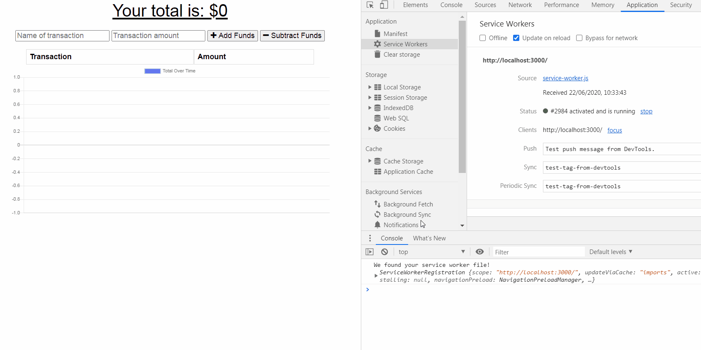

# Budget Tracker
A Budget Tracker application that allows for offline access and functionality.

## Description 
   

A budget tracker application where users track withdrawals and deposits with or without a data/internet connection. If a user is on this Budget Tracker App without an internet connection, the user inputs a withdrawal or deposit then that will be shown on the page, and added to their transaction history when their connection is back online.

## Table of Contents
1. [Installation](#Installation)
2. [Usage](#Usage)
3. [Credits](#Credits)
4. [Contributing](#Contributing)
5. [Licence](#License)

## Installation

Run  `MongoDB`

Run `npm install` in terminal

Run `npm start`

Navigate to `localhost:3000` in the browser

## Usage
* The URL of the deployed application is https://polar-beyond-09663.herokuapp.com/

* The URL of the GitHub repository is https://github.com/CazB67/budget-tracker

The following GIF shows the application's functionality and how to use. 

## Credits
- Team at UWA Coding Bootcamp

## Contributing

## License
 